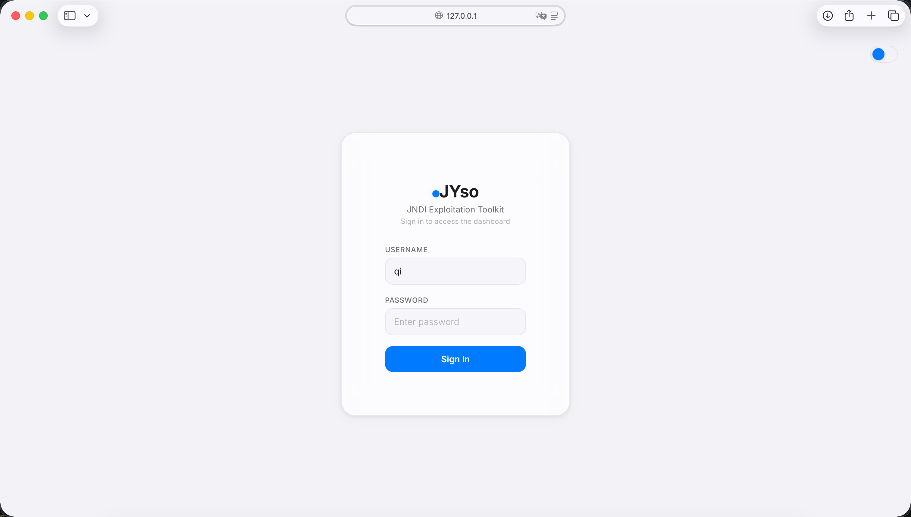
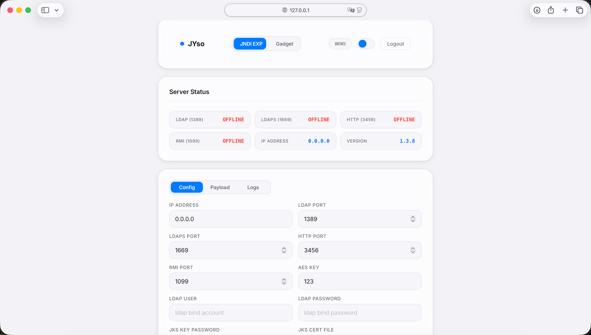
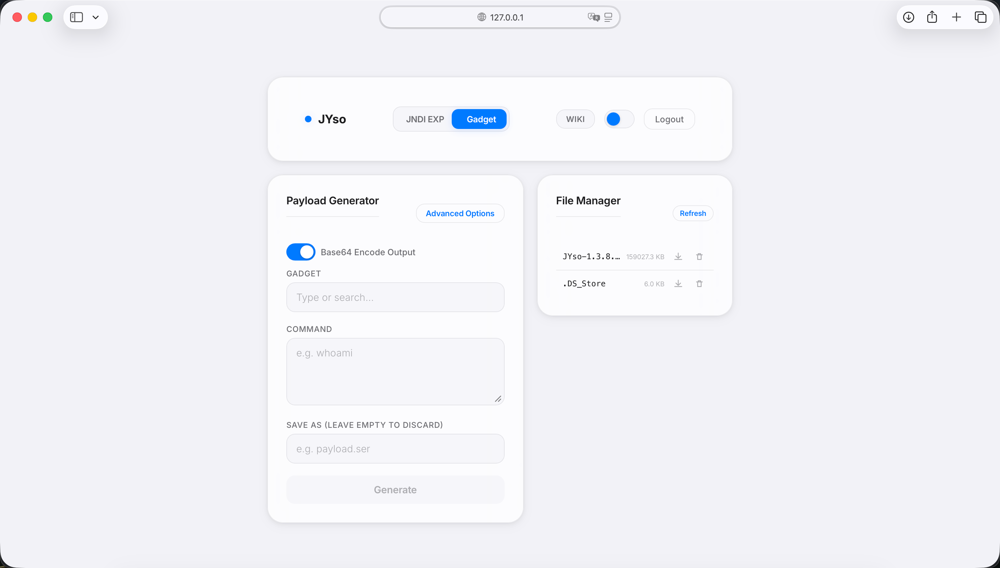

<p align="center">
  
</p>
<h1 style="text-align: center;"> JYso </h1>

<p style="text-align: center;">


<p style="text-align: center;"> 可以同时当做 ysoserial 与 JNDIExploit 使用的工具，同时具备多种JNDI高版本、WAF、RASP的Bypass功能 </p>

<p style="text-align: center;"> 中文文档 | <a href="README.en.md">English</a> </p>

## 🚀 上手指南

📢 请务必花一点时间阅读此文档，有助于你快速熟悉JYso！

🧐 使用文档[Wiki](https://github.com/qi4L/JYso/wiki)。

✔ 下载最新版本的[Releases](https://github.com/qi4L/JYso/releases)。

## 👍 特点

+ GUI启动，使用更加方便
+ JNDI 账号密码启动
+ JNDI 路由隐藏或加密
+ JNDI 高版本Bypass
+ 自定义修改内存马的路径、密码、验证的HTTP头与值
+ 内存马支持[无文件落地Agent打入](https://xz.aliyun.com/t/10075?time__1311=mq%2BxBD9QDQe4yDBkPoN%2BuDAO%3DnB5x&alichlgref=https%3A%2F%2Fxz.aliyun.com%2Fsearch%3Fkeyword%3Drebeyond)
+ 内存马写入 JRE 或环境变量来隐藏
+ 序列化数据加脏数据
+ [序列化数据进行3字节对应的UTF-8编码](https://whoopsunix.com/docs/PPPYSO/advance/UTFMIX/)
+ TemplatesImpl 的 _bytecodes 特征消除且做了大小缩减
+ SignedObject 二次反序列化，可用于绕过如 TemplatesImpl 黑名单，CTF 中常出现的 CC 无数组加黑名单等
+ 解决 Shiro Header 头部过长，从 request 中获取指定参数的值进行类加载
+ 动态生成混淆的类名
+ MSF/CS 上线
+ 通过JDBC来进行代码执行

如果你有其他很棒的想法请务必告诉我！😎

## 🐯 编译

下载 gradle8.7+ 并配置到全局环境变量中，在项目根目录下执行

```shell
./gradlew shadowJar
```

# GUI效果图







## 🌲目录结构

更多信息请参阅[目录结构说明](docs/directory_structure.md)。

## ✨ CTStack


JYso 现已加入 [CTStack](https://stack.chaitin.com/tool/detail/1303) 社区

## ✨ 404星链计划


JYso 现已加入 [404星链计划](https://github.com/knownsec/404StarLink)

1. [入选2024年KCon兵器谱](https://kcon.knownsec.com/index.php?s=bqp&c=category&id=3)

## 📷 参考

- https://github.com/veracode-research/rogue-jndi
- https://github.com/welk1n/JNDI-Injection-Exploit
- https://github.com/welk1n/JNDI-Injection-Bypass
- https://github.com/WhiteHSBG/JNDIExploit
- https://github.com/su18/ysoserial
- https://github.com/rebeyond/Behinder
- https://github.com/Whoopsunix/utf-8-overlong-encoding
- https://github.com/mbechler/marshalsec
- https://t.zsxq.com/17LkqCzk8
- https://mp.weixin.qq.com/s/fcuKNfLXiFxWrIYQPq7OCg
- https://xz.aliyun.com/t/11640?time__1311=mqmx0DBDuDnQ340vo4%2BxCwg%3DQai%3DYzaq4D&alichlgref=https%3A%2F%2Fxz.aliyun.com%2Fu%2F8697
- https://archive.conference.hitb.org/hitbsecconf2021sin/sessions/make-jdbc-attacks-brilliant-again/
- https://tttang.com/archive/1405/#toc_0x03-jdbc-rce
- https://xz.aliyun.com/t/10656?time__1311=mq%2BxBDy7G%3DLOD%2FD0DoYg0%3DDR0HG8KeD&alichlgref=https%3A%2F%2Ftttang.com%2F#toc-7
- https://whoopsunix.com/docs/PPPYSO/advance/UTFMIX/
- https://tttang.com/archive/1405/#toc_groovyclassloader
- https://xz.aliyun.com/t/10656?time__1311=mq%2BxBDy7G%3DLOD%2FD0DoY4AKqiKD%3DOQjqx&alichlgref=https%3A%2F%2Ftttang.com%2F
- https://www.leavesongs.com/PENETRATION/use-tls-proxy-to-exploit-ldaps.html
- https://tttang.com/archive/1405/#toc_druid

